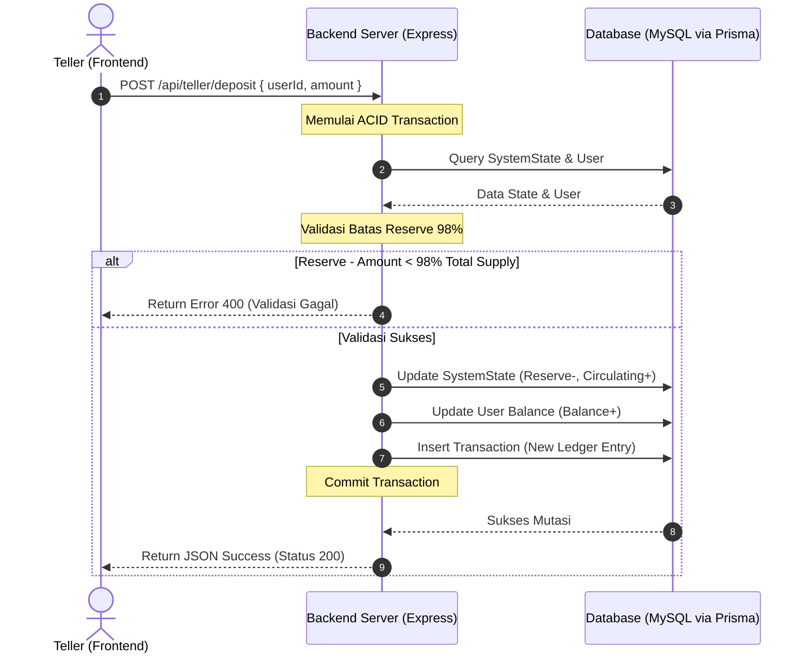

# LAPORAN IMPLEMENTASI MODUL TELLER
## SmartBank (Core Banking System) — Tugas Besar RPL 2

**Identitas Mahasiswa:**
*   **Nama:** Mohammad Isa Widianto
*   **NPM:** 714240013
*   **Kelas:** 2A
*   **Mata Kuliah:** Rekayasa Perangkat Lunak 2 (RPL 2)
*   **Dosen Pengampu:** M. Yusril Helmi Setyawan, S.Kom., M.Kom.

---

## 1. Deskripsi Modul Teller Workspace
Modul **Teller Workspace** pada aplikasi **SmartBank** dirancang khusus untuk memfasilitasi transaksi langsung (*Walk-in*) nasabah di kantor cabang fisik. Sebagai salah satu dari tiga aktor utama di ekosistem SmartBank, Teller memiliki tanggung jawab krusial untuk menjembatani dunia fisik (uang tunai) dengan sistem digital *closed-loop* SmartBank.

Modul ini dikembangkan dengan pendekatan **Single Page Application (SPA)** menggunakan Vanilla JS, CSS Glassmorphism modern pada sisi frontend, dan backend berbasis Node.js/Express dengan database MySQL via Prisma ORM. Seluruh perubahan saldo dikontrol ketat melalui API pusat SmartBank yang bertindak sebagai *Single Source of Truth* (SSOT).

---

## 2. Fitur Utama & Antarmuka Modul Teller

Modul Teller memiliki 4 sub-view utama yang diakses secara dinamis tanpa memuat ulang halaman (*No Reload*) melalui sidebar navigasi:

1.  **Workspace (Dashboard Utama)**
    *   **Pencarian Cepat Nasabah:** Kotak input terpadu untuk mencari data nasabah berdasarkan *ID User* atau *Nomor Rekening* secara real-time.
    *   **Kartu Statistik Ringkasan Shift:**
        *   *Total Transaksi:* Jumlah transaksi yang ditangani selama shift berjalan.
        *   *Setoran Diterima (In):* Akumulasi nominal setoran tunai nasabah.
        *   *Penarikan (Out):* Akumulasi penarikan tunai dan transfer keluar.
    *   **Tabel Antrean Terakhir:** Menampilkan 10 transaksi teratas yang ditangani oleh Teller dengan visualisasi status sukses.
2.  **Layanan Nasabah (Setor & Tarik)**
    *   Muncul secara otomatis setelah nasabah berhasil ditemukan pada pencarian Workspace.
    *   Menampilkan profil nasabah (*Nama*, *ID*, *Nomor Rekening*) beserta *Saldo Tersedia*.
    *   **Form Setor Tunai (Deposit):** Menambahkan saldo digital nasabah dengan memindahkan dana dari *Reserve* ke *Circulating*.
    *   **Form Tarik Tunai (Withdraw):** Mengurangi saldo digital nasabah dengan mengembalikannya ke *Reserve* bank, dilengkapi dengan kalkulasi nominal pecahan uang fisik.
3.  **Transfer Dana**
    *   Form bantuan untuk memproses transfer antar nasabah secara offline.
    *   Membutuhkan *ID Pengirim*, *ID Penerima*, *Jumlah Transfer*, dan *PIN Otorisasi Pengirim*.
4.  **Riwayat Teller**
    *   Menampilkan seluruh daftar transaksi yang diproses khusus oleh unit Teller Pusat secara historis.
    *   Mengimplementasikan pencetakan laporan serta penyortiran data otomatis.

---

## 3. Penerapan Algoritma Ilmu Komputer & Analisis Kompleksitas

Modul Teller mengimplementasikan dua algoritma penting untuk mendukung efisiensi operasional perbankan:

### A. Algoritma Greedy (Pecahan Denominasi Uang Tunai)
*   **Lokasi Kode:** Fungsi `calculateDenominations(amount)` pada [algorithms.js](file:///d:/samrtbank22/smartbank/teller/algorithms.js) dan integrasi UI pada fungsi `handleWithdraw(e)` di [script.js](file:///d:/samrtbank22/smartbank/teller/script.js).
*   **Tujuan:** Membantu Teller menentukan jumlah lembaran uang kertas fisik terkecil/paling sedikit yang harus diserahkan kepada nasabah saat melakukan penarikan tunai (*Withdraw*).
*   **Justifikasi Teknis:** Masalah kembalian/penukaran uang (*Coin Change Problem*) dapat diselesaikan secara optimal menggunakan pendekatan Greedy pada sistem mata uang standar (seperti Rupiah) karena pecahan mata uang Rupiah bersifat *canonical* (100rb, 50rb, 20rb, dll). Pendekatan ini selalu memilih pecahan nominal terbesar yang muat dalam sisa jumlah uang pada setiap iterasi.

#### Pseudocode Algoritma Greedy
```text
Fungsi GreedyDenomination(amount)
    pecahan <- [100000, 50000, 20000, 10000, 5000, 2000, 1000]
    hasil <- Map()
    sisa_nilai <- amount

    Untuk setiap nilai_pecahan dalam pecahan:
        Jika sisa_nilai >= nilai_pecahan maka:
            jumlah_lembar <- floor(sisa_nilai / nilai_pecahan)
            hasil[nilai_pecahan] <- jumlah_lembar
            sisa_nilai <- sisa_nilai mod nilai_pecahan

    Jika sisa_nilai > 0 maka:
        hasil['sisa'] <- sisa_nilai

    Kembalikan hasil
```

#### Simulasi Penelusuran (Tracer) nominal Rp 378.000:
1.  **Iterasi 1 (Pecahan 100.000):** $378.000 \ge 100.000 \rightarrow \lfloor 378.000 / 100.000 \rfloor = 3$ lembar. Sisa: $378.000 \pmod{100.000} = 78.000$.
2.  **Iterasi 2 (Pecahan 50.000):** $78.000 \ge 50.000 \rightarrow \lfloor 78.000 / 50.000 \rfloor = 1$ lembar. Sisa: $78.000 \pmod{50.000} = 28.000$.
3.  **Iterasi 3 (Pecahan 20.000):** $28.000 \ge 20.000 \rightarrow \lfloor 28.000 / 20.000 \rfloor = 1$ lembar. Sisa: $28.000 \pmod{20.000} = 8.000$.
4.  **Iterasi 4 (Pecahan 10.000):** $8.000 < 10.000 \rightarrow$ Lewati.
5.  **Iterasi 5 (Pecahan 5.000):** $8.000 \ge 5.000 \rightarrow \lfloor 8.000 / 5.000 \rfloor = 1$ lembar. Sisa: $8.000 \pmod{5.000} = 3.000$.
6.  **Iterasi 6 (Pecahan 2.000):** $3.000 \ge 2.000 \rightarrow \lfloor 3.000 / 2.000 \rfloor = 1$ lembar. Sisa: $3.000 \pmod{2.000} = 1.000$.
7.  **Iterasi 7 (Pecahan 1.000):** $1.000 \ge 1.000 \rightarrow \lfloor 1.000 / 1.000 \rfloor = 1$ lembar. Sisa: $1.000 \pmod{1.000} = 0$.
8.  **Hasil Akhir:** 3x Rp100.000, 1x Rp50.000, 1x Rp20.000, 1x Rp5.000, 1x Rp2.000, 1x Rp1.000.

#### Analisis Kompleksitas:
*   **Kompleksitas Waktu:** $O(D)$ di mana $D$ adalah jumlah jenis pecahan nominal uang (konstan, untuk Rupiah $D = 7$, sehingga berjalan dalam waktu konstan $O(1)$).
*   **Kompleksitas Ruang:** $O(D)$ untuk menyimpan hasil pemetaan lembar pecahan uang.

---

### B. Algoritma Merge Sort (Divide & Conquer)
*   **Lokasi Kode:** Fungsi `mergeSortTransactions(arr)` dan `merge(left, right)` pada [algorithms.js](file:///d:/samrtbank22/smartbank/teller/algorithms.js) dan dipanggil pada [script.js](file:///d:/samrtbank22/smartbank/teller/script.js).
*   **Tujuan:** Mengurutkan riwayat transaksi Teller secara stabil (*stable sort*) berdasarkan stempel waktu (`createdAt`) dari yang terbaru ke terlama (Descending) sebelum dirender ke tabel riwayat.
*   **Justifikasi Teknis:** Dalam aplikasi finansial, stabilitas pengurutan sangat penting. Jika dua transaksi memiliki stempel waktu yang persis sama, urutan asli mereka tidak boleh tertukar (*Stable Sort*). Merge Sort menjamin stabilitas ini dengan kompleksitas waktu terburuk dan rata-rata yang konsisten pada $O(N \log N)$, berbeda dengan Quick Sort yang dapat menurun hingga $O(N^2)$.

#### Pseudocode Merge Sort
```text
Fungsi MergeSort(Array)
    Jika panjang(Array) <= 1 maka:
        Kembalikan Array

    mid <- floor(panjang(Array) / 2)
    Left <- MergeSort(Array[0..mid-1])
    Right <- MergeSort(Array[mid..end])

    Kembalikan Merge(Left, Right)

Fungsi Merge(Left, Right)
    Hasil <- Array()
    i <- 0, j <- 0

    Selama i < panjang(Left) dan j < panjang(Right) lakukan:
        Jika Waktu(Left[i]) >= Waktu(Right[j]) maka: (Mengurutkan Descending)
            Hasil.append(Left[i])
            i <- i + 1
        Selain itu:
            Hasil.append(Right[j])
            j <- j + 1

    Gabungkan sisa elemen Left dan Right ke dalam Hasil
    Kembalikan Hasil
```

#### Analisis Kompleksitas:
*   **Kompleksitas Waktu:** $O(N \log N)$ pada *Best Case*, *Average Case*, dan *Worst Case* karena array selalu dibagi menjadi dua bagian yang seimbang dan digabungkan secara linear.
*   **Kompleksitas Ruang:** $O(N)$ karena membutuhkan memori tambahan (auxiliary array) untuk melakukan penggabungan (Merge).

---

## 4. Alur Kerja Finansial & Integrasi Database (Backend)

Seluruh permintaan dari frontend dikomunikasikan ke REST API backend yang didefinisikan pada [tellerRoutes.ts](file:///d:/samrtbank22/smartbank/backend/src/routes/tellerRoutes.ts). Backend mengimplementasikan aturan finansial yang ketat:



### A. Validasi Keras Reserve 98% (Anti-Inflasi)
Sesuai aturan moneter ekosistem SmartBank, cadangan bank (*Reserve*) tidak boleh jatuh di bawah 98% dari *Total Supply*.
*   Saat nasabah melakukan **Setor Tunai (Deposit)**, bank akan mencetak uang digital baru dengan memindahkan dana dari `reserve` ke `circulating` nasabah.
*   Sebelum transaksi diproses, sistem memvalidasi secara ketat di database:
    $$\text{Reserve Baru} = \text{Reserve Lama} - \text{Deposit Amount}$$
    $$\text{Batas Minimum Reserve} = \text{Total Supply} \times 0.98$$
*   Jika transaksi menyebabkan $\text{Reserve Baru} < \text{Batas Minimum Reserve}$, transaksi otomatis ditolak (*rolled back*) dengan pesan error demi mencegah terjadinya inflasi berlebih di ekosistem.

### B. ACID Compliance dengan Prisma Transaction
Untuk menjaga konsistensi buku besar (*Ledger*) dan mencegah *race conditions* (seperti kegagalan pencatatan mutasi di tengah jalan), seluruh operasi mutasi saldo di backend dibungkus dalam blok `$transaction` Prisma.
Jika salah satu dari langkah berikut gagal, seluruh rangkaian operasi dibatalkan (*rolled back*) ke kondisi semula:
1.  Mengurangi/menambah saldo nasabah (`User` table).
2.  Mengurangi/menambah status moneter bank (`SystemState` table untuk `reserve` dan `circulating`).
3.  Memasukkan entri riwayat mutasi baru ke tabel ledger (`Transaction` table).

---

## 5. Dokumentasi API Contracts (Teller Endpoints)

Seluruh endpoint API yang digunakan oleh modul Teller diimplementasikan secara modular pada file backend [tellerRoutes.ts](file:///d:/samrtbank22/smartbank/backend/src/routes/tellerRoutes.ts):

| Method | Endpoint | Deskripsi | Parameter Input | Struktur Respons Sukses (JSON) |
| :--- | :--- | :--- | :--- | :--- |
| **GET** | `/api/teller/users/:id` | Mencari data nasabah berdasarkan ID atau Rekening | `id` (Path Parameter) | `{"id": "USR-1029", "name": "Budi", "balance": 4500000, "status": "active"}` |
| **POST** | `/api/teller/deposit` | Proses setor tunai nasabah (menambah circulating) | `{"userId": "USR-1029", "amount": 100000}` | `{"message": "Setor Tunai berhasil", "data": { "state": {...}, "user": {...}, "transaction": {...} }}` |
| **POST** | `/api/teller/withdraw` | Proses tarik tunai nasabah (mengurangi circulating) | `{"userId": "USR-1029", "amount": 50000}` | `{"message": "Tarik Tunai berhasil", "data": { "state": {...}, "user": {...}, "transaction": {...} }}` |
| **POST** | `/api/teller/transfer` | Membantu transfer dana antar-rekening nasabah | `{"senderId": "USR-1029", "receiverId": "USR-5541", "amount": 25000}` | `{"message": "Transfer berhasil", "data": { "transaction": {...} }}` |
| **GET** | `/api/teller/transactions` | Mendapatkan riwayat transaksi Teller | *None* | `[{"id": "TRX-1", "title": "Setor Tunai", "amount": 100000, "createdAt": "..."}]` |
| **GET** | `/api/teller/dashboard` | Statistik shift berjalan & 10 antrean teratas | *None* | `{"stats": {"totalTransactions": 5, "totalIn": 500000, "totalOut": 200000}, "recentQueue": [...]}` |

---

## 6. Skenario Pengujian (Test Cases)

### Test Case 1: Pencarian Nasabah Walk-In
*   **Skenario:** Input ID nasabah valid (misal: `USR-1029`) pada kotak pencarian lalu klik "Cari Nasabah".
*   **Langkah Proses:** API `GET /api/teller/users/USR-1029` dipanggil $\rightarrow$ Data ditemukan $\rightarrow$ Halaman berpindah ke tab "Layanan Nasabah" $\rightarrow$ UI memperbarui Nama Nasabah, ID, dan Saldo Terkini secara reaktif.
*   **Hasil Diharapkan:** Transisi halaman mulus tanpa reload, data profil nasabah tampil presisi di layar.

### Test Case 2: Penarikan Tunai & Pemecahan Uang (Greedy)
*   **Skenario:** Lakukan penarikan tunai sebesar Rp 378.000 dari saldo nasabah yang memiliki saldo cukup.
*   **Langkah Proses:** API `POST /api/teller/withdraw` sukses $\rightarrow$ Frontend memanggil fungsi `calculateDenominations(378000)` $\rightarrow$ Modal Denominasi muncul dengan transisi opacity yang mulus.
*   **Hasil Diharapkan:** Modal menampilkan rincian pecahan fisik secara teratur:
    *   Rp 100.000: 3 Lembar
    *   Rp 50.000: 1 Lembar
    *   Rp 20.000: 1 Lembar
    *   Rp 5.000: 1 Lembar
    *   Rp 2.000: 1 Lembar
    *   Rp 1.000: 1 Lembar
    *   Sisa Koin: Rp 0

### Test Case 3: Setor Tunai Melanggar Batas Reserve 98% (Hyperinflation Check)
*   **Skenario:** Mencoba melakukan setoran bernominal sangat besar yang akan menurunkan reserve bank di bawah batas minimal (Reserve < 98% Total Supply).
*   **Langkah Proses:** API `POST /api/teller/deposit` dikirim $\rightarrow$ Validasi backend mendeteksi pelanggaran aturan moneter ($\text{Reserve Baru} < 98\% \text{ Total Supply}$) $\rightarrow$ Transaction rollback dijalankan $\rightarrow$ Mengembalikan error status 400.
*   **Hasil Diharapkan:** Transaksi dibatalkan, saldo nasabah tidak bertambah, database tetap konsisten, dan muncul alert di UI: *"Gagal: Validasi Keras Gagal: Setoran ini akan membuat Reserve jatuh di bawah 98% dari Total Supply. Transaksi ditolak."*

### Test Case 4: Pengurutan Riwayat (Merge Sort Descending)
*   **Skenario:** Buka tab "Riwayat Teller" untuk melihat daftar transaksi.
*   **Langkah Proses:** API `GET /api/teller/transactions` mengambil data dari database $\rightarrow$ Frontend menjalankan `mergeSortTransactions(transactions)` $\rightarrow$ Tabel dirender ke HTML.
*   **Hasil Diharapkan:** Transaksi terurut secara descending berdasarkan timestamp, transaksi terbaru selalu berada paling atas dengan kompleksitas stabil $O(N \log N)$ tanpa mengalami kegagalan urutan meskipun stempel waktu identik.

---

*Laporan ini disusun secara komprehensif sebagai dokumentasi resmi hasil pengerjaan Tugas Besar mata kuliah Rekayasa Perangkat Lunak 2.*
