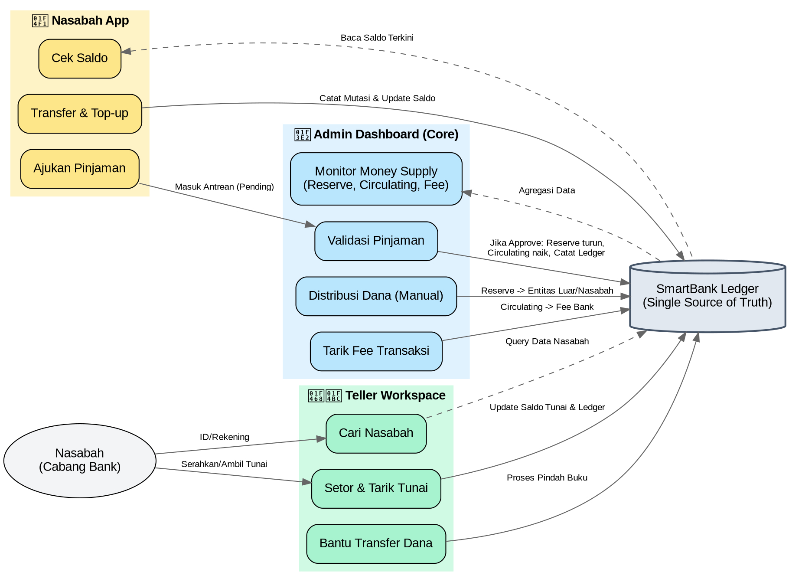

# Visualisasi Workflow Role SmartBank

Berikut adalah kode Graphviz (`.dot`) untuk memvisualisasikan alur kerja dan interaksi antara **Admin**, **Teller**, dan **Nasabah** dengan sistem sentral (Single Source of Truth) dalam ekosistem SmartBank.

Anda dapat memvisualisasikan kode ini dengan cara:
1. Meng-copy kode di bawah ini dan mem-paste nya di [Graphviz Online](https://dreampuf.github.io/GraphvizOnline/).
2. Menggunakan ekstensi VS Code seperti **Graphviz Interactive Preview** atau **PlantUML**.

## Penjelasan Singkat Alur
1. **Single Source of Truth**: Semua perubahan mutasi (Tarik, Setor, Transfer) baik dari **Nasabah App** maupun **Teller Workspace** bermuara langsung pada satu *database* (buku besar).
2. **Validasi Admin**: Pengajuan pinjaman dari Nasabah tidak langsung mengubah saldo, tetapi mengantre ke **Admin Dashboard** untuk divalidasi. Jika disetujui, dana *Reserve* bank berkurang dan disalurkan menjadi *Circulating* (uang beredar).
3. **Pengelolaan Makro**: Admin bertindak layaknya bank sentral; mengatur supply uang, mengumpulkan fee transaksi, serta mengawasi kelancaran sistem dari dashboard terpadu.
